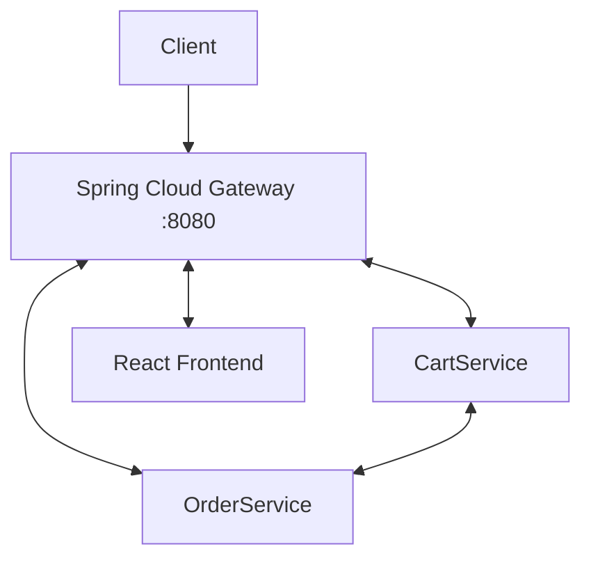

# Shop Microservices

[]()
[]()

**Backend для интернет-магазина** на микросервисах (CartService, OrderService) с API Gateway (Spring Cloud Gateway) с применением паттерна BFF и фронтендом (React)

## Технологии
- **Java 17**, Spring Boot 3, Spring Cloud Gateway
- **База данных:** MongoDB (Payment)
- **Фронтенд:** React
- **Межсервисное взаимодействие:** Kafka
- **Безопасность:** Keycloak
- **Планируется:** Docker, Kubernetes, GitHub Actions

## Архитектура


## Локальный запуск

**Требования:** Java 17+, Maven 3.8+, Node.js 18+, Docker Desctop/Docker + Docker Compose

Сначала необходимо запустить необходимые инструменты с помощью:
```bash
    docker compose up -d --build
```

Далее поочередно запускаем сервисы (на примере CartService):
```bash
    cd CartService
    mvn spring-boot:run -DSkipTests
```
Такую операцию проводим и с остальными сервисами

Далее клонируем [фронтенд репозиторий](https://github.com/tRUStworthyq/e-com-front) и запускаем:
```bash
    git clone https://github.com/tRUStworthyq/e-com-front
    cd e-com-front
    npm ci
    npm start
```

## Roadmap

* [x] Базовая логика микросервисов
* [x] Dockerfile для каждого сервиса
* [x] CI GitHub Actions
* [ ] Общий docker-compose файл для всего приложения
* [ ] Манифесты в ```k8s/```