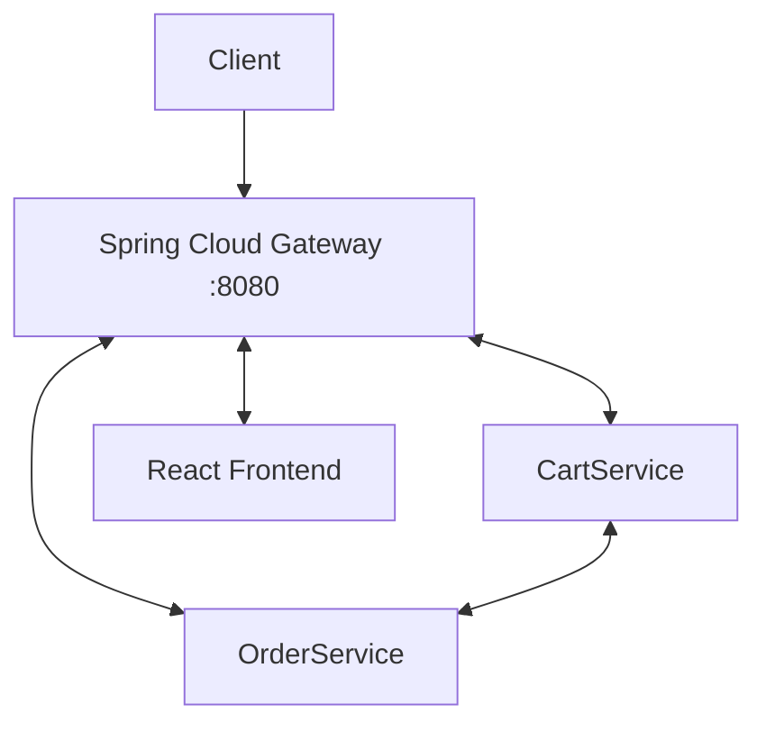

# Shop Microservices

[]()
[]()

**Backend для интернет-магазина** на микросервисах (CartService, OrderService) с API Gateway (Spring Cloud Gateway) с применением паттерна BFF и фронтендом (React)

## Технологии
- **Java 17**, Spring Boot 3, Spring Cloud Gateway
- **База данных:** MongoDB (Payment)
- **Фронтенд:** React
- **Межсервисное взаимодействие:** Kafka
- **Безопасность:** Keycloak
- **Планируется:** Docker, Kubernetes, GitHub Actions

## Архитектура


## Локальный запуск с Docker

**Требования:** Docker Desctop/Docker + Docker Compose

Сначала необходимо запустить PowerShell **от имени администратора** клонировать репозиторий и запустить скрипт:
```bash
    git clone https://github.com/tRUStworthyq/e-com
    cd e-com
    ./setup.ps1
```

Скрипт добавит строку ```127.0.0.1 keycloak``` в файл hosts и запустит контейнеры с помощью ```docker compose up -d```

После запуска переходим в браузер по адресу ```keycloak:8080``` в появившейся форме вводим учетные данные: ```admin/admin```
Выбираем realm ```test``` в верхнем-левом углу страницы

Далее выбираем ```Clients -> gateway -> Credentials``` в форме находим поле ```Client Secret```. Нажимаем на кнопку ```Regenerate```
Копируем значение из поля и добавляем в свой файл ```.env``` в корне проекта, который необходимо создать на основе .env.example

Пример полученного .env файла:
```dotenv
    CLIENT_SECRET=some-client-secret
```

После этого перезапускаем контейнеры:
```bash
    docker compose up -d
```

## Roadmap

* [x] Базовая логика микросервисов
* [x] Dockerfile для каждого сервиса
* [x] CI GitHub Actions
* [x] Общий docker-compose файл для всего приложения
* [ ] Манифесты в ```k8s/```